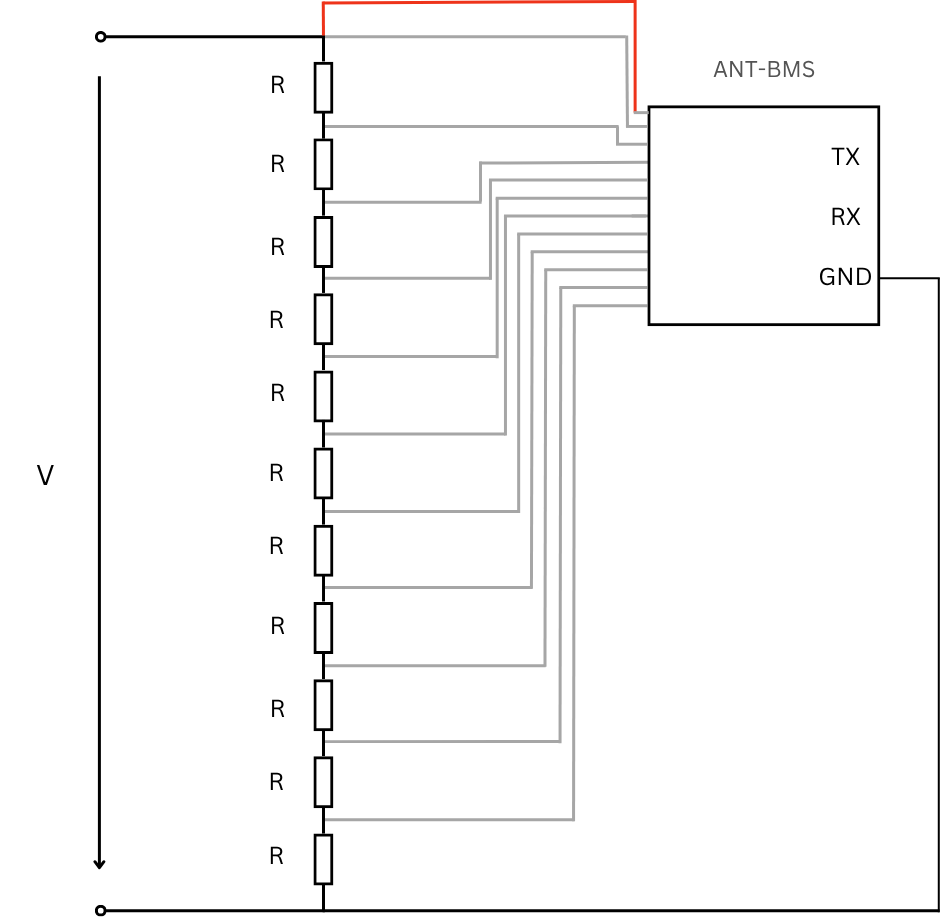
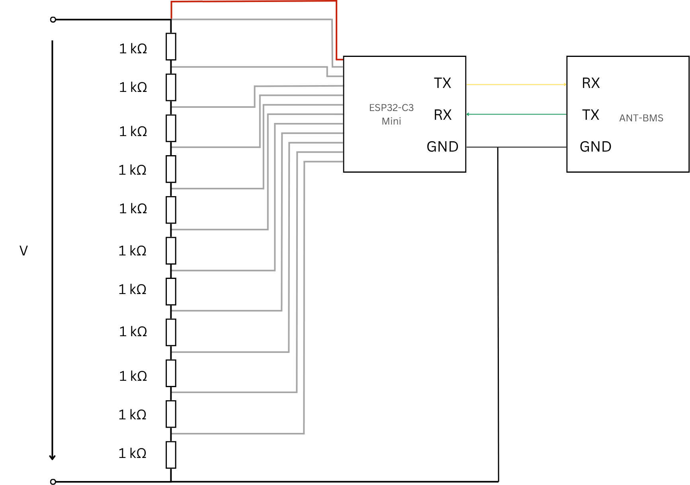

# ANT-BMS-ESP32-C3-UART-Comm
Reverse engineering and implementation of UART communication between Battery Management Systems (BMS) and ESP32-C3-Mini microcontrollers with CAN-Bus integration.

## Project Structure

```
BMS-ESP32-Communication/
├── firmware/
│   ├── src/
│   ├── include/
│   ├── lib/
│   └── platformio.ini
├── hardware/
│   ├── schematics/
│   └── datasheets/
├── docs/
│   ├── protocol-analysis/
│   ├── register-tables/
│   └── setup-guide/
├── data/
│   ├── protocol-captures/
│   └── test-results/
├── tools/
│   └── scripts/
└── examples/
    ├── uart-basic/
    ├── modbus/
    └── can-bridge/
```

## Hardware Requirements

- ESP32-C3-Mini development board
- ANT-BMS (10-24 cell configuration)
- VESC motor controller
- 11x 1kΩ resistors (battery simulation)
- DC power supply
    ### Circuit with resistors

<div align="center">

  


</div>

## Quick Start

```bash
git clone https://github.com/yourusername/BMS-ESP32-Communication.git
cd BMS-ESP32-Communication/firmware
pio run --target upload
```

## Key Features

- UART/Modbus protocol implementation for BMS
- CAN-Bus integration with VESC controllers
- Complete protocol reverse engineering documentation
- Battery cell simulation circuits
- Register table mapping

## Usage Example

```cpp
#include "bms_communication.h"

BMSInterface bms(Serial1);
bms.begin(19200);

// Read cell voltages
auto voltages = bms.readCellVoltages();
float totalVoltage = bms.readTotalVoltage();
```

## Documentation

- **docs/protocol-analysis/**: Reverse engineering findings
- **docs/register-tables/**: BMS register documentation
- **docs/setup-guide/**: Hardware setup instructions
Academic Citation
If you use this project in academic research, please cite:
Sağlam, M. (2025). Reverse Engineering und Implementierung der UART-Kommunikation 
zwischen BMS und ESP32-C3-Mini. Master's Thesis, Rheinland-Pfälzische Technische 
Universität Kaiserslautern-Landau.

## Contact and Support
For questions, issues, or contributions:

Create an issue on GitHub
Contact: [msaglam@rptu.de]


## Acknowledgments

Rheinland-Pfälzische Technische Universität Kaiserslautern-Landau
- Supervisor: Prof. Dr.-Ing. Stefan Götz
- Advisor: Dipl. Ing. Max Köhler
## License

MIT License
